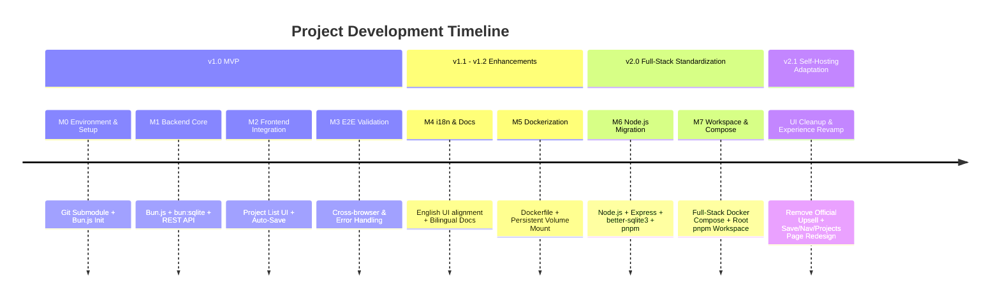

# Project Roadmap: Mermaid Live Editor with Persistent Storage

English | [简体中文](ROADMAP.zh.md)

> **Current Version**: v2.1.0  
> **Status**: ✅ All v1.0, v2.0 and v2.1 milestones completed.  
> **Historical Archive**: For the detailed checkbox task breakdown of past phases, see the [Full Roadmap Archive](docs/ROADMAP_ARCHIVE.md).

---

## 1. Project Evolution & Milestone Summary

### Completed Milestones Summary

| Milestone | Scope | Key Deliverables | Status |
|---|---|---|---|
| **v1.0 MVP (M0–M3)** | Core Persistent Storage | SQLite database schema, CRUD API, frontend Project Browser (`/projects`), debounce auto-save in `/edit`, URL `?projectId=` routing. | ✅ Released |
| **v1.1 (M4)** | Documentation & i18n | Aligned frontend UI with upstream English conventions; established synchronous bilingual docs (`README`, `CONTRIBUTING`). | ✅ Released |
| **v1.2 (M5)** | Containerization | Multi-stage Dockerfile for backend service; SQLite host volume mapping. | ✅ Released |
| **v2.0 (M6–M7)** | Full-Stack & Workspace | Migrated backend to Node.js 22 LTS, Express, `better-sqlite3`, Vitest suite; unified root `pnpm workspace` managing frontend and backend; full-stack `docker-compose.yml` (Nginx + Express + SQLite). | ✅ Released |
| **v2.1** | Self-Hosting Adaptation & UI Cleanup | Removed official upsell elements; split History into Bookmarks (SQLite) & Timeline (localStorage); navbar breadcrumb + canvas toolbar save/bookmark buttons; unified auto-save & status indicator rules; merged config into Code tab via YAML frontmatter and added Samples panel; Projects page 1:1 grid with lazy-loaded rendered previews. | ✅ Released |

---

## 2. Technical Stack Matrix (v2.0 Current)

| Component | Technology Stack | Location |
|---|---|---|
| **Frontend** | SvelteKit 2 + Svelte 5 + TailwindCSS + Monaco Editor + Vite | `mermaid-vault-frontend/` |
| **Backend API** | Node.js 22 LTS + Express + TypeScript + better-sqlite3 | `backend/` |
| **Database** | SQLite with WAL mode & auto-migration | `backend/data/mermaid.db` |
| **Monorepo Management** | pnpm 11+ Workspaces | Root `pnpm-workspace.yaml` |
| **Container Orchestration**| Docker Compose (Multi-stage Node.js + Nginx Alpine) | `docker-compose.yml` |
| **Testing** | Vitest + Supertest | `backend/src/**/*.test.ts` |

## v2.1 – Self-Hosting Adaptation & UI Cleanup (✅ Completed, Archived)
This version focused on removing elements tied to external third-party services in the official Mermaid Live Editor and revamping the save & navigation experience, making the project better suited for self-hosted environments. The detailed task checklist (including key decisions and spec examples) has been compressed and archived in [docs/ROADMAP_ARCHIVE.md](docs/ROADMAP_ARCHIVE.md). Key changes summary:

| Module | Key Changes |
|---|---|
| **Self-Hosting Cleanup** | Removed promotional banner, AI/voice buttons, line-number AI hints, AI Repair upsell, `Edit in Playground` menu; save now triggers local API; GitHub link points to the fork; data security notice rewritten for self-hosting |
| **History Panel** | Split into Bookmarks (manual snapshots stored in backend SQLite, cross-device sync) and Timeline (per-minute snapshots in localStorage only) |
| **Navigation Bar** | Left side replaced with `Projects/${Project Name}` breadcrumb (click name to rename); re-arranged Bookmarks/Timeline/Share/GitHub; added save & bookmark buttons to canvas toolbar; removed Save diagram button |
| **Auto-Save** | Silent save on rename/create/sample switch; 10s inactivity auto-save in code editor; auto-save alongside per-minute Timeline snapshots; save on editor blur |
| **Status Indicators** | saving/saved/bookmarked/failed badges; skip `saving` when done in <3s; success badges fade out after 3s; mobile switches to bottom bar notification |
| **Text Editor** | Removed Config/Docs tabs, merged config into Code tab (YAML frontmatter enclosed by `---` delimiters); added Samples panel (pink category subheadings, flex-arranged sample buttons, sample highlight when code matches) |
| **Projects Page** | Renamed to Projects; search bar aligned with navbar baselines; cards show rendered previews with IntersectionObserver lazy loading; 1:1 grid with adaptive columns (5 landscape / 3 portrait on 4K) |
| **Mobile** | Fixed edit/preview toggle and code editor line-number column colors |

<!-- 
## 3. Future Roadmap (v2.1+ / v3.0 Planning)

The following capabilities are planned for upcoming iterations:

### 3.1 Authentication & Multi-Tenancy (v2.1)
- [ ] **User Authentication**: Support GitHub OAuth / OIDC and local passwordless / token-based authentication.
- [ ] **Multi-Tenant Data Isolation**: Associate projects with `user_id` and enforce row-level access control.
- [ ] **User Profile & Settings**: Custom default Mermaid themes, auto-save interval configuration.

### 3.2 Collaboration & Sharing (v2.2)
- [ ] **Public Share Links**: Generate read-only public sharing links (`/view/:shareToken`).
- [ ] **Project Tagging & Folders**: Organize diagrams into categories, tags, and folders in the project list.
- [ ] **Export Enhancements**: One-click batch export (PNG, SVG, PDF, Markdown bundles).

### 3.3 Version History & Advanced Features (v3.0)
- [ ] **Version History & Rollback**: Automatic revision snapshots with visual diff comparison.
- [ ] **Server-Side Rendering (SSR)**: Server-side rendering endpoint (`/api/render`) for direct SVG/PNG generation in CI/CD pipelines.
- [ ] **Cloud Storage Adapter**: Support S3-compatible object storage for diagram assets and database backups.

---

## 4. Historical Reference
- For the full detailed checklist and development steps, refer to [ROADMAP_ARCHIVE.md](docs/ROADMAP_ARCHIVE.md). -->
