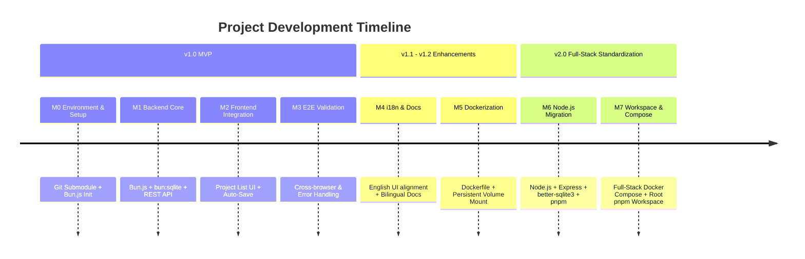

# Project Roadmap: Mermaid Live Editor with Persistent Storage

English | [简体中文](ROADMAP.zh.md)

> **Current Version**: v2.0.0  
> **Status**: ✅ All core v1.0 and v2.0 milestones completed.  
> **Historical Archive**: For the detailed checkbox task breakdown of past phases, see the [Full Roadmap Archive](docs/ROADMAP_ARCHIVE.md).

---

## 1. Project Evolution & Milestone Summary



### Completed Milestones Summary

| Milestone | Scope | Key Deliverables | Status |
|---|---|---|---|
| **v1.0 MVP (M0–M3)** | Core Persistent Storage | SQLite database schema, CRUD API, frontend Project Browser (`/projects`), debounce auto-save in `/edit`, URL `?projectId=` routing. | ✅ Released |
| **v1.1 (M4)** | Documentation & i18n | Aligned frontend UI with upstream English conventions; established synchronous bilingual docs (`README`, `CONTRIBUTING`). | ✅ Released |
| **v1.2 (M5)** | Containerization | Multi-stage Dockerfile for backend service; SQLite host volume mapping. | ✅ Released |
| **v2.0 (M6–M7)** | Full-Stack & Workspace | Migrated backend to Node.js 22 LTS, Express, `better-sqlite3`, Vitest suite; unified root `pnpm workspace` managing frontend and backend; full-stack `docker-compose.yml` (Nginx + Express + SQLite). | ✅ Released |

---

## 2. Technical Stack Matrix (v2.0 Current)

| Component | Technology Stack | Location |
|---|---|---|
| **Frontend** | SvelteKit 2 + Svelte 5 + TailwindCSS + Monaco Editor + Vite | `mermaid-live-editor/` |
| **Backend API** | Node.js 22 LTS + Express + TypeScript + better-sqlite3 | `backend/` |
| **Database** | SQLite with WAL mode & auto-migration | `backend/data/mermaid.db` |
| **Monorepo Management** | pnpm 11+ Workspaces | Root `pnpm-workspace.yaml` |
| **Container Orchestration**| Docker Compose (Multi-stage Node.js + Nginx Alpine) | `docker-compose.yml` |
| **Testing** | Vitest + Supertest | `backend/src/**/*.test.ts` |

## v2.1 – Self-Hosting Adaptation & UI Cleanup
This version focuses on removing elements tied to external third-party services in the official Mermaid Live Editor, making the project cleaner and better suited for self-hosted environments.

- [x] Remove top promotional banner
Remove the top banner promoting "Try Mermaid Advanced Editor — OSS users get 10% off with code JS26".
- [x] Remove top-left AI/voice button on the canvas
Remove the "Edit with AI" / "Edit with voice" entry.
- [x] Update top-right save button behavior
Change the "Save diagram" button from redirecting to the official cloud service to triggering local manual save (invoking the existing persistence API).
- [x] Update GitHub link
Point the top-right GitHub icon link to https://github.com/GeekSquirrel/mermaid-editor.
- [x] Update data security notice
Replace the "Data security" modal description with self-hosted instance and persistent storage documentation.
- [x] Remove "Edit in Playground" from the main menu
Remove the menu entry to avoid redirecting to third-party playgrounds.

- [x] Revamp History Panel Logic
    - Saved Tab: When the user manually clicks the top-right save button, an entry is generated and stored in backend SQLite, enabling cross-device synchronization. Backend capability was added concurrently.
    - Timeline Tab: Auto-saves once every minute into the browser's local storage.

- [x] Navigation Bar Revamp
    - [x] Remove left-side "Mermaid Live Editor" and logo, replace with `Projects/${Project Name}` (or `Projects` when on My Projects page). Clicking `Projects` navigates to My Projects; clicking `${Project Name}` allows renaming the project. Remove duplicate `Projects` button and project rename textbox on the right.
    - [x] Move GitHub icon to the far right of the navigation bar; place Share button 2nd from right with a share icon preceding the text.
    - [x] Remove "Save diagram" button from the navbar.
    - [x] Split History button into two independent buttons: Bookmarks (formerly Saved) and Timeline (both in `icon text` format like Share). Bookmarks is 4th from right, Timeline is 3rd from right. Display bubble badge on Bookmarks showing current bookmark count (hidden when count is 0). Remove upload and save buttons from Timeline panel header (preserving pure per-minute auto-save to localStorage); Bookmarks panel retains all features, replacing save button icon with bookmark-with-plus icon.
    - [x] Add save icon button and bookmark-with-plus icon button to the top-right canvas toolbar (alongside fit, zoom out, zoom in, full screen). Save button triggers manual diagram save; bookmark button saves current state snapshot as bookmark.
    - [x] Move saving/saved status indicators to the right of `Projects/${Project Name}`.

- [x] Auto-Save Logic Update (auto-save refers to persisting latest project state to SQLite, not bookmarks snapshots)
    - [x] Perform auto-save silently when renaming or creating a new project (do not display saving/saved badges).
    - [x] Retain 10s inactivity auto-save in code editor, displaying saving/saved badges.
    - [x] When Timeline generates a 1-minute localStorage snapshot, also trigger an auto-save displaying saving/saved badges.
    - [x] When clicking outside the code editor, ensure the editor loses focus and triggers an auto-save, displaying saving/saved badges.

- [x] Status Indicator Enhancements (next to `Projects/${Project Name}`)
    - [x] Add pink-themed `Bookmarked` badge shown for 3s with fadeout when bookmark is saved successfully to SQLite; show red `Failed to save bookmark` badge on error.
    - [x] If save process completes in < 3s, skip `saving` and display `saved` directly; if save takes > 3s, show `saving` first then switch to `saved`; show red `Failed to save diagram` if save fails.
    - [x] Make the saved badge also fade out and disappear after 3 seconds.
    - [x] On mobile, change status indicators into a bar notification popping up at the bottom-right corner, maintaining original colors, ensuring save times < 3s do not show saving, and keeping 3s fadeout for all non-saving notifications (success/failure/error).

- [x] Text Editor
    - [x] Remove AI prompt before line numbers in code editor and popup dialog on click (remove all official upsell/lead-generation code).
    - [x] Remove "Create a free account to repair with AI" text and "AI Repair" button from syntax error popup (remove all official upsell/lead-generation code).
    - [x] Remove Config tab from text editor and merge configuration into Code tab using YAML frontmatter enclosed by document delimiters (`---`), e.g.:
        ```markdown
        ---
        config:
            theme: dark
        ---
        architecture-beta
            group api(cloud)[API]

            service db(database)[Database] in api
            service disk1(disk)[Storage] in api
            service disk2(disk)[Storage] in api
            service server(server)[Server] in api

            db:L -- R:server
            disk1:T -- B:server
            disk2:T -- B:db
        ```
        Ensure that both configuration and diagram code parse and render correctly under the new format.
    - [x] Remove the Docs button from the top-right of the editor Card header.
    - [x] Merge sample diagrams into the editor panel as a `Samples` tab at the previous Docs button location. Retain the sample diagrams icon and name it `Samples`. In the Samples panel, redesign the UI: for each diagram type, render the type name as a top-left subheading, and the example titles as buttons arranged in a flex layout. Display all diagram types in a vertical list. If a diagram type has only one example, name it `Basic ${diagramType}`.
    - [x] Change category subheadings in Samples panel to theme pink.
    - [x] Keep editor top bar unchanged (never cover or replace Code button when opening Samples panel), allowing users to click Code or Samples to switch to the corresponding panel.
    - [x] Unify Code and Samples top bar button styles (both active and inactive states match current Samples button).
    - [x] Code editor scrollbar style matches Samples panel scrollbar.
    - [x] Trigger an auto-save silently when switching sample diagrams, without displaying saving/saved badges.
    - [x] Highlight the corresponding sample button when editor code matches a sample (upon successful selection, or when navigating back to Samples with matching code).

- [x] Projects Page Redesign
    - [x] Rename `My Projects` to `Projects` in the left main menu.
    - [x] Remove the desktop `New Project` button to the left of the GitHub icon in the Projects navbar; add a mobile GitHub icon to the far right of the mobile navbar.
    - [x] Align search bar and project card grid container with navbar margins (matching `px-4 sm:px-6` so the search input aligns with the left menu and action buttons align with the GitHub icon on the right).
    - [x] Remove the `My Projects` headline and the `Manage your Mermaid diagrams and chart projects saved in cloud storage` subtitle.
    - [x] Position search input on the far left with appropriate max-width; group Refresh and New Project buttons in a parent container positioned on the far right.
    - [x] Fix downward vertical offset of the search icon in the search input.
    - [x] Increase project card height, replace raw code snippet preview with rendered SVG diagram preview using `IntersectionObserver` lazy loading, and display syntax error messages directly for invalid diagrams.
    - [x] Change card arrangement to grid layout, adapting column count based on screen width (reference standard: 16:9 4K display, 5 columns on landscape, 3 columns on portrait), keep cell aspect ratio 1:1, leave appropriate gaps matching layout margins, and make cards fill the cells.
    - [x] Search box border is clearly visible and adopts the same design language as project cards.

- [x] Mobile UI Fixes
    - [x] Fix the Edit / View toggle switch on mobile.
    - [x] Fix incorrect line numbers column background color in the mobile code editor to match dark/light theme colors.


<!-- 
## 3. Future Roadmap (v2.1+ / v3.0 Planning)

The following capabilities are planned for upcoming iterations:

### 3.1 Authentication & Multi-Tenancy (v2.1)
- [ ] **User Authentication**: Support GitHub OAuth / OIDC and local passwordless / token-based authentication.
- [ ] **Multi-Tenant Data Isolation**: Associate projects with `user_id` and enforce row-level access control.
- [ ] **User Profile & Settings**: Custom default Mermaid themes, auto-save interval configuration.

### 3.2 Collaboration & Sharing (v2.2)
- [ ] **Public Share Links**: Generate read-only public sharing links (`/view/:shareToken`).
- [ ] **Project Tagging & Folders**: Organize diagrams into categories, tags, and folders in the project list.
- [ ] **Export Enhancements**: One-click batch export (PNG, SVG, PDF, Markdown bundles).

### 3.3 Version History & Advanced Features (v3.0)
- [ ] **Version History & Rollback**: Automatic revision snapshots with visual diff comparison.
- [ ] **Server-Side Rendering (SSR)**: Server-side rendering endpoint (`/api/render`) for direct SVG/PNG generation in CI/CD pipelines.
- [ ] **Cloud Storage Adapter**: Support S3-compatible object storage for diagram assets and database backups.

---

## 4. Historical Reference
- For the full detailed checklist and development steps, refer to [ROADMAP_ARCHIVE.md](docs/ROADMAP_ARCHIVE.md). -->
