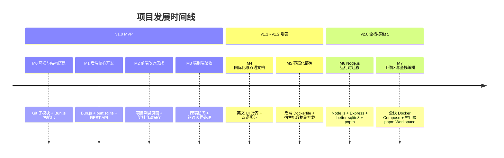

# 项目路线图：带持久化存储的 Mermaid Live Editor

[English](ROADMAP.md) | 简体中文

> **当前版本**：v2.0.0  
> **当前状态**：✅ v1.0 与 v2.0 核心里程碑全部完成。  
> **历史归档**：如需查阅已完成阶段的逐项任务清单（Checkbox 拆解），请参阅 [完整历史路线图归档](docs/ROADMAP_ARCHIVE.md)。

---

## 1. 项目演进与历史里程碑概览

### 已完成里程碑摘要

| 里程碑 | 目标范围 | 核心交付物 | 状态 |
|---|---|---|---|
| **v1.0 MVP (M0–M3)** | 持久化存储核心功能 | SQLite 数据库结构、CRUD API、前端项目浏览页（`/projects`）、`/edit` 防抖自动保存、`?projectId=` 路由机制。 | ✅ 已发布 |
| **v1.1 (M4)** | 文档与国际化对齐 | 前端界面文案与官方纯英文风格统一；建立根目录与后端的双语同步文档（`README`, `CONTRIBUTING`）。 | ✅ 已发布 |
| **v1.2 (M5)** | 容器化部署 | 后端多阶段构建 Dockerfile；SQLite 宿主机持久化卷映射。 | ✅ 已发布 |
| **v2.0 (M6–M7)** | 全栈技术栈与工作区重构 | 后端迁移至 Node.js 22 LTS、Express、`better-sqlite3`、Vitest 测试套件；根目录 `pnpm workspace` 统一管理前后端；全栈 `docker-compose.yml`（Nginx + Express + SQLite）。 | ✅ 已发布 |

---

## 2. 当前技术栈矩阵 (v2.0)

| 模块 | 技术栈 | 所在目录 |
|---|---|---|
| **前端** | SvelteKit 2 + Svelte 5 + TailwindCSS + Monaco Editor + Vite | `mermaid-live-editor/` |
| **后端 API** | Node.js 22 LTS + Express + TypeScript + better-sqlite3 | `backend/` |
| **数据库** | SQLite（启用 WAL 模式与自动迁移） | `backend/data/mermaid.db` |
| **Monorepo 管理** | pnpm 11+ Workspaces | 根目录 `pnpm-workspace.yaml` |
| **容器编排** | Docker Compose（多阶段 Node.js + Nginx Alpine） | `docker-compose.yml` |
| **自动化测试** | Vitest + Supertest | `backend/src/**/*.test.ts` |

---

## 3. 后续迭代规划 (v2.1+ / v3.0 Planning)

以下特性纳入后续版本迭代计划：

### 3.1 用户认证与多租户隔离 (v2.1)
- [ ] **用户认证体系**：支持 GitHub OAuth / OIDC 及本地 Token 登录鉴权。
- [ ] **多用户数据隔离**：项目关联 `user_id`，实现行级权限与隔离。
- [ ] **个性化设置**：自定义默认 Mermaid 主题、自动保存时间间隔等。

### 3.2 协作与分享 (v2.2)
- [ ] **公开分享链接**：一键生成只读分享链接（`/view/:shareToken`）。
- [ ] **项目分组与标签**：支持项目分类、标签筛选与文件夹组织。
- [ ] **增强导出**：支持批量一键导出（PNG、SVG、PDF、Markdown 压缩包）。

### 3.3 版本历史与高级特性 (v3.0)
- [ ] **版本历史与回滚**：自动保存历史快照，提供图形化版本对比与恢复。
- [ ] **服务端渲染 (SSR)**：提供服务端图表渲染接口（`/api/render`），便于 CI/CD 自动化调用生成图片。
- [ ] **云存储扩展**：支持 S3 兼容对象存储与数据库定时自动备份。

---

## 4. 历史记录查询
- 完整逐项任务清单请参阅：[docs/ROADMAP_ARCHIVE.md](docs/ROADMAP_ARCHIVE.md)。
