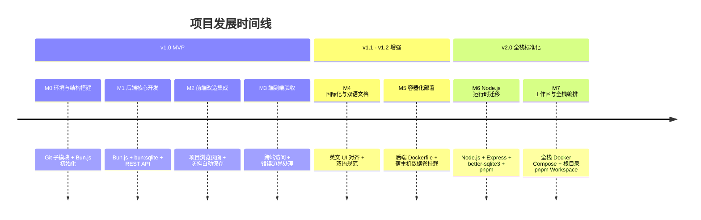

# 项目路线图：带持久化存储的 Mermaid Live Editor

[English](ROADMAP.md) | 简体中文

> **当前版本**：v2.0.0  
> **当前状态**：✅ v1.0 与 v2.0 核心里程碑全部完成。  
> **历史归档**：如需查阅已完成阶段的逐项任务清单（Checkbox 拆解），请参阅 [完整历史路线图归档](docs/ROADMAP_ARCHIVE.md)。

---

## 1. 项目演进与历史里程碑概览



### 已完成里程碑摘要

| 里程碑 | 目标范围 | 核心交付物 | 状态 |
|---|---|---|---|
| **v1.0 MVP (M0–M3)** | 持久化存储核心功能 | SQLite 数据库结构、CRUD API、前端项目浏览页（`/projects`）、`/edit` 防抖自动保存、`?projectId=` 路由机制。 | ✅ 已发布 |
| **v1.1 (M4)** | 文档与国际化对齐 | 前端界面文案与官方纯英文风格统一；建立根目录与后端的双语同步文档（`README`, `CONTRIBUTING`）。 | ✅ 已发布 |
| **v1.2 (M5)** | 容器化部署 | 后端多阶段构建 Dockerfile；SQLite 宿主机持久化卷映射。 | ✅ 已发布 |
| **v2.0 (M6–M7)** | 全栈技术栈与工作区重构 | 后端迁移至 Node.js 22 LTS、Express、`better-sqlite3`、Vitest 测试套件；根目录 `pnpm workspace` 统一管理前后端；全栈 `docker-compose.yml`（Nginx + Express + SQLite）。 | ✅ 已发布 |

---

## 2. 当前技术栈矩阵 (v2.0)

| 模块 | 技术栈 | 所在目录 |
|---|---|---|
| **前端** | SvelteKit 2 + Svelte 5 + TailwindCSS + Monaco Editor + Vite | `mermaid-live-editor/` |
| **后端 API** | Node.js 22 LTS + Express + TypeScript + better-sqlite3 | `backend/` |
| **数据库** | SQLite（启用 WAL 模式与自动迁移） | `backend/data/mermaid.db` |
| **Monorepo 管理** | pnpm 11+ Workspaces | 根目录 `pnpm-workspace.yaml` |
| **容器编排** | Docker Compose（多阶段 Node.js + Nginx Alpine） | `docker-compose.yml` |
| **自动化测试** | Vitest + Supertest | `backend/src/**/*.test.ts` |

---

## v2.1 – 自托管适配与 UI 清理
本版本聚焦于移除官方 Mermaid Live Editor 中与外部服务绑定的元素，使项目更适合自托管场景。

- [x] 移除顶部推广横幅
去掉顶部 “Try Mermaid Advanced Editor — OSS users get 10% off with code JS26” 横幅。
- [x] 移除画板左上角的 AI/语音按钮
删除 “Edit with AI” 或 “Edit with voice” 入口。
- [x] 修改右上角保存行为
将 “Save diagram” 按钮从跳转官网改为本地手动触发保存（调用已有保存接口）。
- [x] 更新 GitHub 链接
将右上角 GitHub 图标链接指向 https://github.com/GeekSquirrel/mermaid-editor。
- [x] 更新左下角数据安全文案
将 “Data security” 描述替换为自托管版本的介绍说明。
- [x] 移除左上角菜单中的“Edit in playground”
删除该菜单项，避免跳转至第三方 playground。

- [x] 历史面板逻辑重做
    - Saved页面：当用户手动点击右上角保存时生成一个条目，数据存储于后端的sqlite，可以实现跨设备同步。需要同时在修改前端逻辑的同时，给后端新增对应的能力。
    - Timeline页面：每分钟自动保存一次，存储在浏览器的local storage即可。

- [x] 导航栏重做
    - [x] 去除左侧 Mermaid Live Editor及其LOGO，改为 Projects/${Project Name}（如果是在My Projects界面则只显示Projects）。单击Projects跳转到My Projects页面，单击${Project Name}可修改项目名称。去除右侧重复的Projects按钮和项目重命名文本框
    - [x] github图标调整至导航栏最右侧；share按钮在从右数第二位，并在文字前新增分享icon
    - [x] 删除save diagram按钮
    - [x] 将history按钮按其面边功能拆分成两个独立按钮：Bookmarks（原saved）和Timeline（都是和share一样的`icon 文字`的按钮形式）。Bookmarks在导航栏右侧右数第四位，timeline在第三位。Bookmarks右上角气泡显示当前书签数量（书签为0时不显示气泡）。去掉Timeline面板中顶栏右侧的上传按钮和保存按钮（保持Timeline按分钟自动保存到local storage的纯粹性）；Bookmarks面板继承原来的所有功能，但把顶栏的保存按钮icon替换为带加号的书签icon。
    - [x] 在编辑器右上角的工具栏（当前自动缩放、缩小、放大、全屏功能）新增保存icon按钮和带加号书签icon按钮。保存按钮提供手动保存功能，带加号书签按钮将当前状态作为快照保存（功能与Bookmarks面板中的带加号书签按钮相同）。
    - [x] saving/saved等保存状态标识提示移动到 Projects/${Project Name} 的右侧旁边

- [x] 自动保存逻辑更新（自动保存均指保存到sqlite中项目的最新状态，而非保存到sqlite中的bookmarks快照）
    - [x] 重命名和新建项目时，执行自动保存操作，但不显示saving/saved的标识
    - [x] 保留当前代码编辑框10秒无变更则自动保存的逻辑，显示saving/saved的标识
    - [x] 新增timeline生成每分钟local storage快照时，也顺带执行一次自动保存，显示saving/saved的标识
    - [x] 当鼠标点击文本编辑器之外时确保编辑器失去焦点并触发一次自动保存，显示saving/saved的标识

- [x] 状态标识增强（指 Projects/${Project Name} 的右侧旁边的状态标识）
    - [x] 新增粉红主题色的bookmarked标识，在用户成功保存书签到sqlite后显示，显示3秒后淡出消失；如保存失败则显示红色标识Failed to save bookmark
    - [x] 当自动/手动保存过程过程小于3秒种时，不显示saving，直接在成功保存后显示saved；超过3秒再显示saving，保存成功后切换为saved；若最终保存失败则显示Failed to save diagram
    - [x] saved标识也做成显示3秒钟后淡出消失
    - [x] 移动端当中标识改为右下角弹出的条形通知，保持原来配色，保持保存时间小于3秒不能显示saving。除saving外的成功/失败/报错等通知依然保持3秒后淡出。

- [x] 文本编辑器
    - [x] 去除代码编辑器行号前的AI提示和点击之后的弹窗(移除所有相关的引流至官方的代码)
    - [x] 去除代码编辑器报错时底部弹出提示中的Create a free account to repair with AI和AI Repair按钮(移除所有相关的引流至官方的代码)
    - [x] 移除文本编辑器的config标签页，将配置信息合并到code标签页当中。配置语法由json切换为（文档顶部分隔符包围的）yaml，具体示例如下
        ```markdown
        ---
        config:
            theme: dark
        ---
        architecture-beta
            group api(cloud)[API]

            service db(database)[Database] in api
            service disk1(disk)[Storage] in api
            service disk2(disk)[Storage] in api
            service server(server)[Server] in api

            db:L -- R:server
            disk1:T -- B:server
            disk2:T -- B:db
        ```
        确保新格式下，配置和绘图代码都可以得到正确解析。
    - [x] 去掉编辑器顶栏的最右侧的doc按钮
    - [x] 将sample diagrams作为一个标签页合并到文本编辑器面板，放置在之前doc的位置。sample diagram的icon不变，标题简写为Samples。Samples面板中，重写UI。对于每个类型的图表：将类型名称作为左上角小标题，二级菜单中的图标样例标题作为按钮，按钮以flex形式排列。面板以纵向列表的形式展示所有图标类型。如果图标只有一个样例，则样例名为`Basic ${类型名称}`
    - [x] sample面板中左上角小标题改为主题粉红色
    - [x] 保持编辑器顶栏不变（打开sample面板时不要遮盖code按钮），允许用户点击code/samples切换到对应面板
    - [x] 顶栏的code和samples的按钮样式保持一致，选中高亮和未选中样式也保持一致，均与当前samples按钮为准
    - [x] code编辑器的滚动条样式和samples面板一致，以samples面板的滚动条为准
    - [x] 用户切换sample时触发一次自动保存，但不显示saving/saved的标识

- [x] My Projects页面升级
    - [x] 左侧菜单中的My Projects更名为Projects
    - [x] 去掉桌面端Projects页面中，导航栏上，github图标左侧的的New Projects按钮；为移动端在导航栏最右侧添加github图标。
    - [x] 搜索栏+卡片列表的最外侧容器和顶部导航栏左右侧对齐。即视觉上，导航栏的菜单最左侧和github图标最右侧为左右侧基准线，下方可见的最左侧/最右侧组件应该分别与之对齐。
    - [x] Projects页面中，移除搜索栏中的`My Projects`大标题以及下方`Manage your Mermaid diagrams and chart projects saved in cloud storage`相关代码。
    - [x] 搜索栏中，搜索框至于搜索栏最左侧，设置合适的最大宽度；刷新和new projects并入一个父容器后，父容器至于搜索栏最右侧
    - [x] 修复Search projects的icon向下偏移的问题。
    - [x] 项目卡片高度拉高，中间的预览界面从代码预览改为渲染后结果预览，为了性能考量采取懒加载（即将可见时再加载卡片）。对于语法错误卡片直接显示syntax error的内容。
    - [x] 卡片排列改为grid布局，根据屏幕宽度自适应列数（参考标准： 16:9 4k屏，横屏时5列，竖屏时3列），保持格子宽高比为1:1，格子间参考整体布局的左右边距留出适当gap，卡片填满格子。
    - [x] 搜索框边框要可见采用和卡片边框一致的设计语言

- [x] 移动端界面修复
    - [x] 修复编辑/预览切换按钮失效的问题。
    - [x] 修复代码编辑器行号一列颜色不正确的问题。

<!-- ## 3. 后续迭代规划 (v2.1+ / v3.0 Planning)

以下特性纳入后续版本迭代计划：

### 3.1 用户认证与多租户隔离 (v2.1)
- [ ] **用户认证体系**：支持 GitHub OAuth / OIDC 及本地 Token 登录鉴权。
- [ ] **多用户数据隔离**：项目关联 `user_id`，实现行级权限与隔离。
- [ ] **个性化设置**：自定义默认 Mermaid 主题、自动保存时间间隔等。

### 3.2 协作与分享 (v2.2)
- [ ] **公开分享链接**：一键生成只读分享链接（`/view/:shareToken`）。
- [ ] **项目分组与标签**：支持项目分类、标签筛选与文件夹组织。
- [ ] **增强导出**：支持批量一键导出（PNG、SVG、PDF、Markdown 压缩包）。

### 3.3 版本历史与高级特性 (v3.0)
- [ ] **版本历史与回滚**：自动保存历史快照，提供图形化版本对比与恢复。
- [ ] **服务端渲染 (SSR)**：提供服务端图表渲染接口（`/api/render`），便于 CI/CD 自动化调用生成图片。
- [ ] **云存储扩展**：支持 S3 兼容对象存储与数据库定时自动备份。
 -->

---

## 4. 历史记录查询
- 完整逐项任务清单请参阅：[docs/ROADMAP_ARCHIVE.md](docs/ROADMAP_ARCHIVE.md)。
